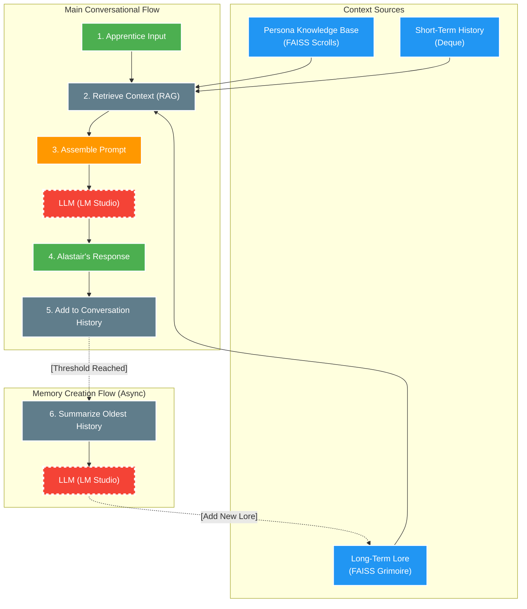

# **Alastair: An AI Loremaster with a Hybrid Memory System**

## **Overview**

Alastair is a technical demonstration of a stateful conversational AI companion built with a sophisticated hybrid memory system. This project showcases how to create a rich AI persona that can remember details across long conversations and sessions, leading to more meaningful, context-aware, and immersive interactions.

The AI persona is **Alastair, the Loremaster**, an ancient and wise wizard who guides the user, his apprentice, with riddles, parables, and forgotten lore.

This project is designed to run entirely on your local machine, using [LM Studio](https://lmstudio.ai/) to serve a local Large Language Model (LLM) and a local sentence-transformer model for generating embeddings.

## **Core Features**

* **Hybrid Memory System**: Combines a deque for volatile, short-term conversational memory with a persistent, long-term memory store.  
* **Dynamic Memory Creation**: The LLM intelligently summarizes chunks of conversation into concise "memories" or "lore," which are then stored for future recall.  
* **Deep Persona Knowledge Base**: The AI's personality is defined by a collection of markdown files, detailing not just his communication style, but his home, his core philosophies, and the legends of his world.  
* **Retrieval-Augmented Generation (RAG)**: A multi-layered RAG pipeline retrieves context from three distinct sources (persona knowledge, long-term lore, and short-term dialogue) to generate highly consistent, in-character responses.  
* **Stateful & Persistent**: Alastair remembers conversations across multiple sessions by saving and loading his memory from a FAISS vector store, ensuring true continuity.  
* **Local & Private**: By leveraging LM Studio and local embedding models, the entire system runs offline, ensuring user privacy and zero API costs.

## **System Architecture**



## **Setup and Installation**

### **Prerequisites**

* Python 3.8+
* [LM Studio](https://lmstudio.ai/) installed and running.
* A compatible GGUF model downloaded and loaded within LM Studio (Mistral-based models work well).
* Git for cloning the repository.

### **1\. Clone the Repository**

```bash
git clone [your-github-repo-url]
cd [your-repo-name]
```

### **2\. Set Up the Environment**

It is highly recommended to use a Python virtual environment.

```bash
# Create and activate the virtual environment
python -m venv venv
source venv/bin/activate  # On Windows: venv\Scripts\activate

# Install the required packages
pip install -r requirements.txt
```

### **3\. Review the Persona**

The AI's personality is defined by the markdown files in the alastair\_persona\_kb directory. The project includes six detailed files to create a rich, interactive character. You can edit these to shape his personality.

### **4\. Launch LM Studio**

* Open LM Studio.
* Load your desired model.
* Navigate to the "Local Server" tab (the \<--\> icon).
* Click **Start Server**.

### **5\. Run the Application**

With the LM Studio server running, execute the main script in your terminal:

```bash
python main_alastair.py
```

The script will initialize Alastair's memory and begin the conversation. Speak, and the Loremaster shall answer.
